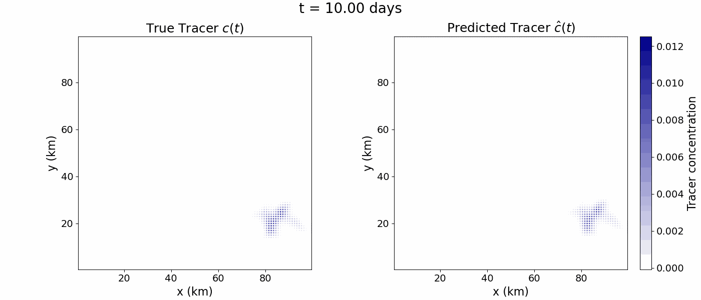

# Demo (coming soon)

This page will host a precomputed example you can run quickly to verify the pipeline end-to-end without generating new simulations.
You can compare the performance of physics-informed vs data-only models.

!!! info "Status"
    The interactive demo is not live yet. This page documents the intended demo workflow and shows an example output.

---

## Example output (placeholder)

---

## What the demo will include (soon)

- A small sample dataset (NetCDF)
- Two model modes:
  - **Physics OFF**: data-only model
  - **Physics ON**: physics-informed model (PDE residual penalty)
- One command (or a lightweight UI) to run inference
- Outputs:
  - a prediction figure/GIF
  - a metrics summary (JSON/CSV)

---

## Planned usage (placeholder)

From the code repo:

- Install dependencies: `uv sync`
- Run inference:
  - `uv run python -m oae_pinn.demo --model physics_on --data demo`
  - `uv run python -m oae_pinn.demo --model physics_off --data demo`

---

## Links

[View code](https://github.com/OAE-PINN-Emulator/OAE-PINN-Emulator){ .md-button .md-button--primary }
[Reproduce guide](reproduce.md){ .md-button }

