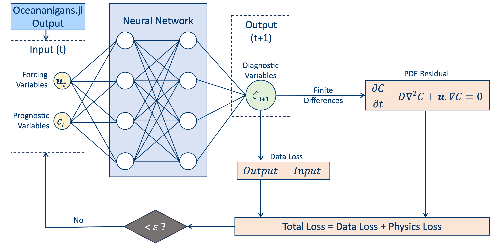

#OAE PINN Emulator

A **physics-informed neural network emulator** for **2-D ocean tracer transport** used in Ocean Alkalinity Enhancement (OAE) studies.

The project explores machine learning based emulators for tracer evolution using **Oceananigans.jl** simulations as training while also penalizing **advection–diffusion PDE residuals**, aiming to stay physically consistent and generalize across forcing.

[View code](https://github.com/OAE-PINN-Emulator/OAE-PINN-Emulator){ .md-button .md-button--primary }
[Run demo](demo.md){ .md-button }

---

## Example prediction (placeholder)

---

## Model overview

---

## Tech stack

- **Oceananigans.jl** simulations → tracer + velocity fields  
- **NetCDF** outputs → processed with **xarray**
- Training in **PyTorch** (single-step + multi-step variants; physics loss optional)

